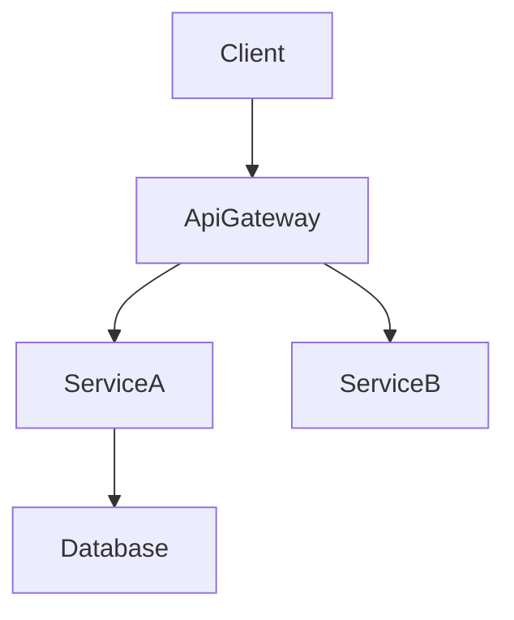

# 技術設計ルールと原則

## コア設計原則

### 1. 型安全性は必須 (Type Safety is Mandatory)
- TypeScriptのインターフェースで **決して** `any` 型を使用しないこと
- すべての引数と戻り値に対して明示的な型を定義すること
- エラー処理には判別共用体 (Discriminated Unions) を使用すること
- ジェネリクスの制約を明確に指定すること

### 2. 実装ではなく設計 (Design vs Implementation)
- **HOW（どうやって）ではなく、WHAT（何を）に焦点を当てる**
- コードではなく、インターフェースと契約を定義する
- 事前/事後条件を通じて振る舞いを指定する
- アルゴリズムではなく、アーキテクチャ上の決定を文書化する

### 3. 視覚的コミュニケーション (Visual Communication)
- **単純な機能**: 基本的なコンポーネント図、または図なし
- **中程度の複雑さ**: アーキテクチャ図 + データフロー図
- **高い複雑さ**: 複数の図（アーキテクチャ、シーケンス、状態遷移）
- **常に純粋なMermaidを使用**: スタイリングなし、構造のみ

### 4. コンポーネント設計ルール (Component Design Rules)
- **単一責任**: コンポーネントごとに1つの明確な目的を持つ
- **明確な境界**: 明示的なドメイン所有権
- **依存の方向性**: アーキテクチャレイヤーに従う
- **インターフェース分離**: 最小限の、焦点の絞られたインターフェース
- **チームセーフなインターフェース**: マージ競合なしに並行実装を可能にする境界を設計する
- **調査の追跡可能性**: 境界の決定とその根拠を `research.md` に記録する

### 5. データモデリング標準 (Data Modeling Standards)
- **ドメインファースト**: ビジネスコンセプトから始める
- **一貫性の境界**: 明確な集約ルート (Aggregate Roots)
- **正規化**: パフォーマンスと整合性のバランスをとる
- **進化**: スキーマ変更を計画に入れる

### 6. エラー処理の哲学 (Error Handling Philosophy)
- **フェイルファスト**: 早期かつ明確に検証する
- **グレースフルデグラデーション**: 完全な停止より部分的な機能を優先する
- **ユーザーコンテキスト**: アクション可能なエラーメッセージ
- **可観測性**: 包括的なロギングとモニタリング

### 7. 統合パターン (Integration Patterns)
- **疎結合**: 依存関係を最小限にする
- **契約ファースト**: 実装の前にインターフェースを定義する
- **バージョニング**: APIの進化を計画する
- **冪等性**: リトライ安全性のある設計にする
- **契約の可視性**: APIとイベントの契約を `design.md` に明示し、詳細な拡張情報は `research.md` からリンクする

## ドキュメンテーション標準

### 言語とトーン
- **宣言的**: 「システムは認証すべきである」ではなく「システムはユーザーを認証する」
- **正確**: 曖昧な記述より具体的な技術用語を使用する
- **簡潔**: 必須情報のみ
- **フォーマル**: プロフェッショナルな技術文書

### 構造要件
- **階層的**: 明確なセクション構成
- **追跡可能**: コンポーネントへの要件マッピング
- **完全**: 実装に必要なすべての側面をカバー
- **一貫性**: 全体を通して統一された用語
- **焦点**: `design.md` はアーキテクチャと契約に集中させる。調査ログや長大な比較は `research.md` に移動する

## セクション執筆ガイダンス

### 全体の順序
- デフォルトフロー: 概要 → 目標/非目標 → 要件トレーサビリティ → アーキテクチャ → 技術スタック → システムフロー → コンポーネント & インターフェース → データモデル → オプションセクション。
- 明確さが向上する場合は、トレーサビリティを前に出したり、データモデルをアーキテクチャの近くに移動してもよい。ただしセクション見出しは維持すること。
- 各セクション内では、レビュアーが一貫してスキャンできるよう **要約 → スコープ → 決定事項 → 影響/リスク** のフローを維持する。

### 要件ID
- 要件は `2.1, 2.3` のようにプレフィックスなしで参照すること（「要件 2.1」とは書かない）。
- すべての要件は数値IDを持つ必要がある。数値IDがない要件がある場合は、続行する前に `requirements.md` を修正すること。
- `requirements.md` のトップレベル要件番号を `N` として、`N.M` 形式の数値IDを使用する（例：要件1 → 1.1, 1.2; 要件2 → 2.1, 2.2）。
- すべてのコンポーネント、タスク、トレーサビリティ行は、同じ正規の数値IDを参照しなければならない。

### 技術スタック
- この機能に影響するレイヤー（フロントエンド、バックエンド、データ、メッセージング、インフラ）のみを含めること。
- 各レイヤーについて、ツール/ライブラリ + バージョン + 役割を指定する。詳細な根拠、比較、ベンチマークは `research.md` に移動する。
- 既存システムを拡張する場合は、現在のスタックからの逸脱を強調し、新しい依存関係をリストアップする。

### システムフロー
- 振る舞いを明確にする場合にのみ図を追加する：
  - **シーケンス**: 複数ステップの相互作用
  - **プロセス/状態**: 分岐ルールまたはライフサイクル
  - **データ/イベント**: パイプラインまたは非同期パターン
- 常に純粋なMermaidを使用する。複雑なフローがない場合は、セクション全体を省略する。

### 要件トレーサビリティ
- カバレッジを証明するために標準テーブル（`Requirement | Summary | Components | Interfaces | Flows`）を使用する。
- 単一の要件が1:1でコンポーネントにマップされる場合のみ、箇条書き形式に短縮してもよい。
- 単純なマッピングにはコンポーネントの要約テーブルを優先し、複雑またはコンプライアンスに敏感な要件には完全なトレーサビリティテーブルを予約する。
- 要件やコンポーネントが変更された場合は、乖離を防ぐためにこのマッピングを再実行すること。

### コンポーネント & インターフェース執筆
- コンポーネントをドメイン/レイヤーごとにグループ化し、コンポーネントごとに1つのブロックを提供する。
- コンポーネント、ドメイン、意図、要件カバレッジ、主要な依存関係、選択された契約をリストする要約テーブルから始める。
- テーブルフィールド: 意図（1行）、要件（`2.1, 2.3`）、オーナー/レビュアー（任意）。
- 依存関係テーブルは、各エントリを Inbound/Outbound/External としてマークし、重要度（`P0` ブロッキグ, `P1` 高リスク, `P2` 参考）を割り当てる必要がある。
- 外部依存関係の調査要約はここに記載する。詳細な調査（APIシグネチャ、レート制限、移行ノート）は `research.md` に属する。
- `design.md` は自己完結型のレビュー成果物でなければならない。`research.md` は背景としてのみ参照し、結論や決定事項はここで再提示すること。
- 契約: 関連するタイプ（Service/API/Event/Batch/State）のみをチェックする。チェックされていないタイプは後のコンポーネントセクションに表示してはならない。
- サービスインターフェースは、メソッドシグネチャ、入出力、エラーエンベロープを宣言する必要がある。API/Event/Batch契約には、トリガー、ペイロード、配信、冪等性をカバーするスキーマテーブルまたは箇条書きリストが必要である。
- ロールアウト戦略、可観測性、未解決の決定を文書化するために、**統合 & 移行ノート**、**検証フック**、**未解決の質問 / リスク**を使用する。
- 詳細密度ルール:
  - **フルブロック**: 新しい境界（ロジックフック、共有サービス、外部統合、データレイヤー）を導入するコンポーネント。
  - **要約のみ**: 新しい境界を持たないプレゼンテーション/UIコンポーネント（必要に応じて短い実装ノートを追加）。
- 実装ノートは、繰り返しを減らすために、統合/検証/リスクを単一の箇条書きサブセクションにまとめる必要がある。
- 短いデータ（依存関係、契約選択）にはリストまたはインライン記述子を優先する。複数の項目を比較する場合にのみテーブルを使用する。

### 共有インターフェース & Props
- 繰り返し使用されるUIコンポーネントにはベースインターフェース（例：`BaseUIPanelProps`）を定義し、コンポーネントごとに拡張して差分のみをキャプチャする。
- 新しい契約を導入するフック、ユーティリティ、統合アダプターには、完全なTypeScriptシグネチャを含める必要がある。
- ベース契約を再利用する場合は、コードブロックを複製するのではなく、明示的に参照する（例：「`BaseUIPanelProps` を拡張し、`onSubmitAnswer` コールバックを追加」）。

### データモデル
- ドメインモデルは、集約、エンティティ、値オブジェクト、ドメインイベント、不変条件をカバーする。関係が自明でない場合にのみMermaid図を追加する。
- 論理データモデルは、変更に関連する構造、インデックス作成、シャーディング、ストレージ固有の考慮事項（イベントストア、KV/ワイドカラム）を明確にする必要がある。
- データ契約 & 統合セクションは、機能が境界を越える場合のAPIペイロード、イベントスキーマ、クロスサービス同期パターンを文書化する。
- 長い型定義やベンダー固有のオプションオブジェクトは、`design.md` 内の「参考資料 (Supporting References)」セクションに配置し、関連セクションからリンクする。調査ノートは `research.md` に残す。
- 参考資料の使用は任意である。本文に情報を保持すると可読性が低下する場合にのみ作成すること。すべての決定事項は依然としてメインセクションに表示し、`design.md` が単独で成立するようにすること。

### エラー/テスト/セキュリティ/パフォーマンスセクション
- 機能固有の決定または逸脱のみを記録する。基本的な実践については再述せず、組織全体の標準（ステアリング）をリンクまたは参照すること。

### 図とテキストの重複排除
- 図の内容を散文で逐語的に再述しないこと。テキストは、視覚的には明らかでない重要な決定、トレードオフ、または影響を強調するために使用する。
- 決定が図の注釈で完全にキャプチャされている場合、短い「主要な決定」の箇条書きで十分である。

### 一般的な重複排除
- 概要、アーキテクチャ、コンポーネント間で同じ情報を繰り返さないこと。コンテキストが同一の場合は前のセクションを参照すること。
- 要件とコンポーネントの関係が要約テーブルでキャプチャされている場合、追加のニュアンスがない限り、他の場所で書き直さないこと。

## 図のガイドライン

### 図を含めるタイミング
- **アーキテクチャ**: 3つ以上のコンポーネントまたは外部システムが相互作用する場合は構造図を使用する。
- **シーケンス**: 呼び出し/ハンドシェイクが複数のステップに及ぶ場合はシーケンス図を描く。
- **状態 / フロー**: 複雑なステートマシンやビジネスフローを専用の図でキャプチャする。
- **ER**: 自明でないデータモデルには実体関連図を提供する。
- **スキップ**: マイナーな1コンポーネントの変更には通常、図は不要である。

### Mermaid要件

- **プレーンなMermaidのみ** – カスタムスタイリングや非サポートの構文は避ける。
- **ノードID** – 英数字とアンダースコアのみ（例: `Client`, `ServiceA`）。`@`、`/`、または先頭の `-` は使用しない。
- **ラベル** – 単純な単語。括弧 `()`、角括弧 `[]`、引用符 `"`、スラッシュ `/` を埋め込まないこと。
  - ❌ `DnD[@dnd-kit/core]` → 無効なID (`@`)。
  - ❌ `UI[KanbanBoard(React)]` → 無効なラベル (`()`)。
  - ✅ `DndKit[dnd-kit core]` → ラベルにはプレーンテキストを使用し、技術詳細は付随する説明に記述する。
  - ℹ️ Mermaidのstrict-modeでは `Expecting 'SQE' ... got 'PS'` のようなエラーで失敗するため、レンダリング前にラベルから句読点を削除すること。
- **エッジ** – データまたは制御フローの方向を示す。
- **グループ** – 関連するコンポーネントをクラスタリングするためにMermaidのサブグラフを使用することは許可されるが、明確さのために控えめに使用すること。

## 品質メトリクス
### 設計完全性チェックリスト
- すべての要件が対処されている
- 実装の詳細が漏れていない
- 明確なコンポーネント境界
- 明示的なエラー処理
- 包括的なテスト戦略
- セキュリティが考慮されている
- パフォーマンス目標が定義されている
- 移行パスが明確である（該当する場合）

### 避けるべき一般的なアンチパターン
❌ 設計と実装の混同
❌ 曖昧なインターフェース定義
❌ エラーシナリオの欠落
❌ 非機能要件の無視
❌ 過度に複雑なアーキテクチャ
❌ コンポーネント間の密結合
❌ データ整合性戦略の欠落
❌ 不完全な依存関係分析