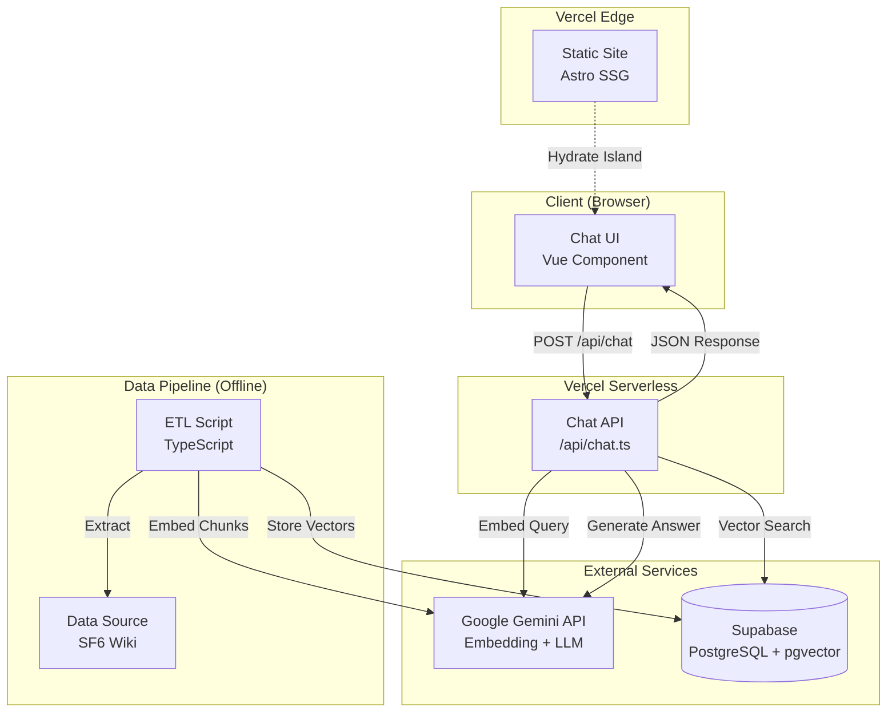
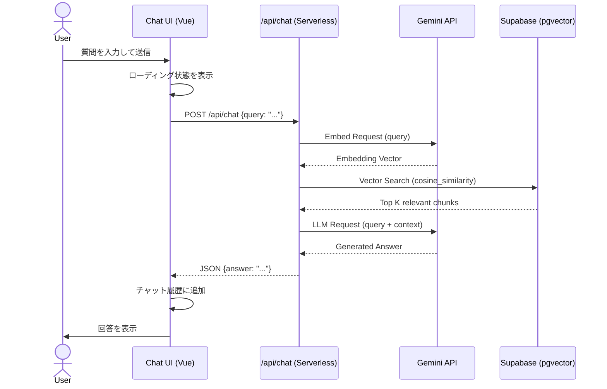
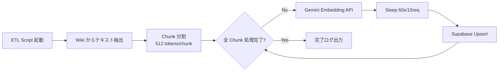
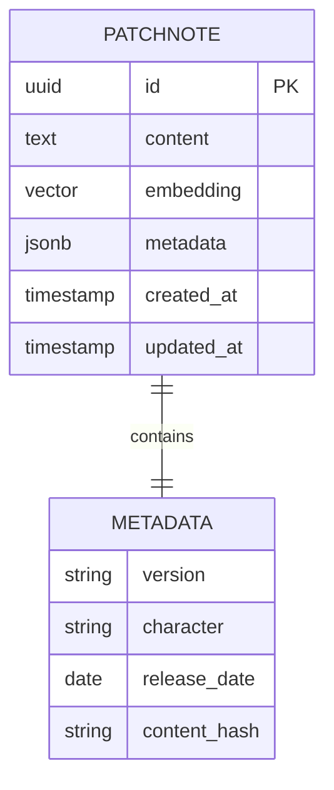

# SF6 パッチノート RAG 機能 設計書

## Overview

**Purpose**: 本機能は、既存の Astro ベースの技術ブログに SF6 パッチノートに関する AI チャット機能を統合し、訪問者が自然言語で質問して関連情報を取得できるようにします。

**Users**: ブログ訪問者（主に SF6 プレイヤー）が、パッチノートの膨大なテキストを手動で検索することなく、特定のキャラクターや変更点について質問できます。

**Impact**: ブログの静的な情報発信に加え、動的なインタラクティブ機能を Island として追加します。ブログ全体のパフォーマンスは維持しつつ、付加価値を提供します。

### Goals

- SF6 パッチノートに関する質問に RAG（Retrieval Augmented Generation）で回答する AI チャット機能を実装
- Island Architecture により、ブログ全体のパフォーマンス（Core Web Vitals）を維持
- 個人運用可能なコスト効率（Gemini API 無料枠 + 月額 50 円、Supabase Free Tier）
- RAG 汎用ライブラリとして切り出し可能な設計

### Non-Goals

- リアルタイム対戦データの取得・分析
- 複数言語対応（初期は日本語のみ）
- 音声入力・出力機能
- ユーザーアカウント・チャット履歴の永続化（初期フェーズでは不要）

## Architecture

### Architecture Pattern & Boundary Map



**Architecture Integration**:
- **Selected pattern**: Island Architecture（部分的 Hydration）+ Serverless RAG
  - **理由**: ブログ本体は静的生成でパフォーマンス最適化、チャット部分のみクライアント側で動的に Hydration
- **Domain boundaries**:
  - **Static Content Domain**: Astro による静的サイト生成（ブログ記事、ポートフォリオ）
  - **Interactive Feature Domain**: チャット UI（Vue Island）+ RAG API（Serverless Function）
  - **Data Pipeline Domain**: オフライン ETL（バッチ処理）
- **Existing patterns preserved**:
  - MDX によるコンテンツ管理
  - Vercel へのデプロイフロー
  - TypeScript + ESLint によるコード品質管理
- **New components rationale**:
  - **Chat UI（Vue）**: インタラクティブな UI が必要なため Astro だけでは不十分
  - **Serverless API**: API キーをサーバーサイドで管理し、クライアントに露出させない
  - **pgvector**: ベクトル検索を高速に行うため、PostgreSQL の拡張機能を使用
- **Steering compliance**:
  - pnpm 使用、TypeScript 型安全性、コスト効率重視の原則を維持

### Technology Stack

| Layer | Choice / Version | Role in Feature | Notes |
|-------|------------------|-----------------|-------|
| Frontend | Vue.js 3.x | チャット UI コンポーネント | Astro Island として統合 |
| Backend | Astro Server Endpoint | RAG API（`/api/chat.ts`） | Vercel Serverless Function |
| AI Service | Google Gemini API (v2.5 Pro) | Embedding + LLM | 無料枠: 15 RPM, 1500 RPD |
| Database | Supabase (PostgreSQL 15 + pgvector 0.5) | ベクトルストア | Free Tier:<50MB DB, 500MB storage |
| Deployment | Vercel | ホスティング + CI/CD | 既存のデプロイフローを維持 |
| Data Pipeline | TypeScript (Node.js) | ETL スクリプト | 手動実行 or GitHub Actions |

**技術選定の理由**:
- **Vue.js**: Astro との統合が容易で、リアクティブな UI 構築に適している
- **Gemini API**: OpenAI よりもコスト効率が良く、無料枠が充実
- **Supabase**: PostgreSQL ベースで SQL によるフィルタリングが可能、pgvector のサポート
- **Vercel**: 既存のブログが Vercel でホスティングされており、追加コストなし

## System Flows

### ユーザー質問・回答フロー



**フロー上の設計決定**:
- **エラーハンドリング**: 各外部 API 呼び出しで try-catch を実装し、タイムアウトやレート制限をユーザーに通知
- **レート制限対策**: Gemini API のレート制限（15 RPM）に接近した場合、クライアント側でリトライ間隔を表示

### ETL（データパイプライン）フロー



**設計決定**:
- **Chunk サイズ**: 512 トークン（Gemini の Context Window に最適）
- **レート制限遵守**: 15 RPM を守るため、15 リクエストごとに 60 秒の Sleep を挿入
- **Upsert 戦略**: 同じ content_hash を持つレコードは更新（重複排除）

## Requirements Traceability

| Requirement | Summary | Components | Interfaces | Flows |
|-------------|---------|------------|------------|-------|
| 1 | チャット UI | ChatWindow (Vue) | Props, Emits | User Query Flow |
| 2 | RAG API | ChatAPIHandler | POST /api/chat | User Query Flow |
| 3 | ETL Pipeline | ETLScript | CLI | ETL Flow |
| 4 | Database Schema | PatchnotesTable | SQL Schema | - |
| 5 | Security | EnvConfig, CORS | - | - |
| 6 | Error Handling | ErrorBoundary, APIError | - | User Query Flow |
| 7 | Performance | IslandHydration, IndexOptimization | - | - |
| 8 | Library Separation | @zakizaki-ri9/rag-core | npm package | - |

## Components and Interfaces

| Component | Domain/Layer | Intent | Req Coverage | Key Dependencies (P0/P1) | Contracts |
|-----------|--------------|--------|--------------|--------------------------| ----------|
| ChatWindow | UI | チャットインターフェースの表示 | 1, 6 | ChatAPI (P0) | State, Props |
| ChatAPIHandler | Backend | RAG 処理のオーケストレーション | 2, 5 | GeminiService (P0), SupabaseClient (P0) | API |
| GeminiService | Backend | Gemini API の抽象化 | 2, 5 | Gemini SDK (P0) | Service |
| SupabaseClient | Backend | Supabase の抽象化 | 2, 4 | Supabase SDK (P0) | Service |
| ETLScript | Data Pipeline | パッチノートの取得と格納 | 3 | GeminiService (P0), SupabaseClient (P0) | Batch |
| PatchnotesTable | Data | ベクトルデータの保存 | 4 | pgvector (P0) | Schema |

### UI Layer

#### ChatWindow (Vue Component)

| Field | Detail |
|-------|--------|
| Intent | ユーザーとのチャットインターフェースを提供 |
| Requirements | 1, 6 |

**Responsibilities & Constraints**
- ユーザー入力の受付とバリデーション（最大 500 文字）
- チャット履歴の表示（セッション内のみ、永続化なし）
- ローディング状態とエラーメッセージの表示

**Dependencies**
- Outbound: ChatAPI — POST リクエスト送信 (P0)

**Contracts**: State [x]

##### State Management

```typescript
interface ChatState {
  messages: Array<{
    role: 'user' | 'assistant';
    content: string;
    timestamp: number;
  }>;
  isLoading: boolean;
  error: string | null;
}
```

**Persistence**: セッションストレージに一時保存（リロードで消失）

**Implementation Notes**
- Astro Island として `client:load` で Hydration
- テキストエリアは 500 文字制限
- Enter キーで送信、Shift+Enter で改行

### Backend Layer

#### ChatAPIHandler

| Field | Detail |
|-------|--------|
| Intent | ユーザーの質問を受け取り、RAG処理を実行して回答を返す |
| Requirements | 2, 5, 6 |

**Responsibilities & Constraints**
- リクエストバリデーション（query の存在確認、文字数制限）
- Gemini API と Supabase のオーケストレーション
- エラーハンドリングとレート制限管理

**Dependencies**
- Outbound: GeminiService — Embedding + LLM (P0)
- Outbound: SupabaseClient — Vector Search (P0)

**Contracts**: API [x]

##### API Contract

| Method | Endpoint | Request | Response | Errors |
|--------|----------|---------|----------|--------|
| POST | /api/chat | `ChatRequest` | `ChatResponse` | 400, 429, 500, 503 |

```typescript
interface ChatRequest {
  query: string; // max 500 chars
}

interface ChatResponse {
  answer: string;
  sources?: Array<{
    content: string;
    metadata: {
      version: string;
      character?: string;
    };
  }>;
}

interface ErrorResponse {
  error: {
    code: string;
    message: string;
  };
}
```

**Error Codes**:
- `400 INVALID_REQUEST`: query が空または 500 文字超過
- `429 RATE_LIMIT`: Gemini API のレート制限到達
- `500 INTERNAL_ERROR`: 予期しない内部エラー
- `503 SERVICE_UNAVAILABLE`: Gemini または Supabase のダウンタイム

**Implementation Notes**
- Astro の `export async function POST()` で実装
- 環境変数から API キーを読み込み（`import.meta.env`）
- タイムアウト: 30 秒

#### GeminiService

| Field | Detail |
|-------|--------|
| Intent | Gemini API の呼び出しを抽象化 |
| Requirements | 2, 5 |

**Responsibilities & Constraints**
- Embedding API の呼び出し
- LLM API（generateContent）の呼び出し
- レート制限の監視とエラーハンドリング

**Dependencies**
- External: Google Gemini API (P0)

**Contracts**: Service [x]

##### Service Interface

```typescript
interface GeminiService {
  embed(text: string): Promise<Result<number[], EmbedError>>;
  generateAnswer(query: string, context: string): Promise<Result<string, GenerateError>>;
}

type Result<T, E> = { ok: true; value: T } | { ok: false; error: E };

interface EmbedError {
  type: 'RATE_LIMIT' | 'NETWORK' | 'INVALID_INPUT';
  message: string;
}

interface GenerateError {
  type: 'RATE_LIMIT' | 'NETWORK' | 'SAFETY_FILTER';
  message: string;
}
```

**Preconditions**:
- `GEMINI_API_KEY` 環境変数が設定されている
- `text` は 10,000 文字以内

**Postconditions**:
- Embedding は 768 次元のベクトル
- Generated Answer は 2000 文字以内

**Implementation Notes**
- `@google/generative-ai` SDK を使用
- Embedding Model: `text-embedding-004`
- LLM Model: `gemini-2.0-flash-exp`

#### SupabaseClient

| Field | Detail |
|-------|--------|
| Intent | Supabase（PostgreSQL + pgvector）の操作を抽象化 |
| Requirements | 2, 4 |

**Responsibilities & Constraints**
- ベクトル類似度検索
- メタデータによるフィルタリング
- Upsert 操作（ETL 用）

**Dependencies**
- External: Supabase (P0)

**Contracts**: Service [x]

##### Service Interface

```typescript
interface SupabaseClient {
  searchSimilar(
    embedding: number[],
    topK: number,
    filters?: MetadataFilter
  ): Promise<Result<SearchResult[], SearchError>>;
  
  upsertChunk(chunk: PatchnoteChunk): Promise<Result<void, UpsertError>>;
}

interface SearchResult {
  id: string;
  content: string;
  metadata: {
    version: string;
    character?: string;
    date: string;
  };
  similarity: number;
}

interface PatchnoteChunk {
  content: string;
  embedding: number[];
  metadata: {
    version: string;
    character?: string;
    date: string;
    content_hash: string;
  };
}

interface MetadataFilter {
  version?: string;
  character?: string;
}
```

**Implementation Notes**
- `@supabase/supabase-js` を使用
- RPC 関数 `match_patchnotes` を呼び出し（cosine similarity）

### Data Pipeline Layer

#### ETLScript

| Field | Detail |
|-------|--------|
| Intent | SF6 パッチノートデータの抽出・変換・格納 |
| Requirements | 3 |

**Responsibilities & Constraints**
- Wiki からのテキスト抽出（cheerio または Playwright）
- Chunk 分割（512 トークン単位）
- Gemini API でのベクトル化
- Supabase への Upsert

**Dependencies**
- Outbound: GeminiService (P0)
- Outbound: SupabaseClient (P0)
- External: SF6 Wiki (P1)

**Contracts**: Batch [x]

##### Batch Contract

**Trigger**: 手動実行 `pnpm run etl:sf6` または GitHub Actions（月次）

**Input**: 
- Wiki URL（コマンドライン引数または環境変数）
- バージョン番号（例: `v1.2.0`）

**Output**:
- Supabase `patchnotes` テーブルに新規 Chunk を追加
- ログファイル `logs/etl-{timestamp}.log`

**Idempotency & Recovery**:
- `content_hash`（SHA-256）により重複を検出し、Upsert で更新
- エラーが発生した Chunk は `errors.json` に記録し、再実行時にスキップ可能

**Implementation Notes**
- `src/scripts/etl-sf6.ts` に実装
- 15 RPM を守るため、バッチ処理にスリープを挿入

## Data Models

### Domain Model



**Aggregates**:
- **Patchnote Chunk**: 単一の不可分な情報単位

**Invariants**:
- `content` は空文字列でない
- `embedding` は 768 次元
- `metadata.content_hash` は一意

### Physical Data Model

**Table: patchnotes**

```sql
CREATE TABLE patchnotes (
  id UUID PRIMARY KEY DEFAULT gen_random_uuid(),
  content TEXT NOT NULL,
  embedding VECTOR(768) NOT NULL,
  metadata JSONB NOT NULL,
  created_at TIMESTAMPTZ DEFAULT NOW(),
  updated_at TIMESTAMPTZ DEFAULT NOW()
);

-- ベクトル類似度検索用のインデックス
CREATE INDEX ON patchnotes USING ivfflat (embedding vector_cosine_ops)
  WITH (lists = 100);

-- メタデータフィルタリング用のインデックス
CREATE INDEX ON patchnotes USING gin (metadata jsonb_path_ops);

-- content_hash による重複検出用
CREATE UNIQUE INDEX ON patchnotes ((metadata->>'content_hash'));
```

**Indexes**:
- `ivfflat`: 近似最近傍探索（ANN）を高速化
- `gin`: JSONB メタデータのフィルタリングを高速化
- `content_hash`: 重複挿入を防止

**RPC Function for Vector Search**:

```sql
CREATE OR REPLACE FUNCTION match_patchnotes(
  query_embedding VECTOR(768),
  match_threshold FLOAT,
  match_count INT,
  filter_metadata JSONB DEFAULT '{}'
)
RETURNS TABLE (
  id UUID,
  content TEXT,
  metadata JSONB,
  similarity FLOAT
)
LANGUAGE plpgsql
AS $$
BEGIN
  RETURN QUERY
  SELECT
    patchnotes.id,
    patchnotes.content,
    patchnotes.metadata,
    1 - (patchnotes.embedding <=> query_embedding) AS similarity
  FROM patchnotes
  WHERE 
    (filter_metadata = '{}' OR patchnotes.metadata @> filter_metadata)
    AND 1 - (patchnotes.embedding <=> query_embedding) > match_threshold
  ORDER BY similarity DESC
  LIMIT match_count;
END;
$$;
```

### Data Contracts & Integration

**API Data Transfer** (Chat API):
- Request/Response: JSON
- Validation: Zod スキーマで型安全性を確保

```typescript
import { z } from 'zod';

export const ChatRequestSchema = z.object({
  query: z.string().min(1).max(500)
});

export const ChatResponseSchema = z.object({
  answer: z.string(),
  sources: z.array(z.object({
    content: z.string(),
    metadata: z.object({
      version: z.string(),
      character: z.string().optional()
    })
  })).optional()
});
```

## Error Handling

### Error Strategy

- **User Errors (4xx)**: 入力バリデーション違反 → フィールドレベルのエラーメッセージを UI に表示
- **System Errors (5xx)**: 外部 API の障害 → ユーザーに「一時的な問題が発生しました。しばらくしてから再試行してください」と表示
- **Rate Limit (429)**: Gemini API のレート制限到達 → 「リクエストが多すぎます。1 分後に再試行してください」と表示

### Error Categories and Responses

| Error Code | Category | User Message | Recovery Action |
|------------|----------|--------------|-----------------|
| 400 | User Error | 「質問は 1〜500 文字で入力してください」 | 入力を修正 |
| 429 | Rate Limit | 「リクエストが多すぎます。1分後に再試行してください」 | UI で 60 秒のカウントダウンを表示 |
| 500 | System Error | 「予期しないエラーが発生しました」 | ログに記録、管理者に通知 |
| 503 | Service Unavailable | 「現在サービスが利用できません」 | リトライボタンを表示 |

### Monitoring

- **Vercel Analytics**: API のレスポンスタイムとエラー率を監視
- **Supabase Dashboard**: クエリのパフォーマンスと DB 使用量を監視
- **Google Cloud Console**: Gemini API の使用状況とレート制限を監視

## Testing Strategy

### Unit Tests
- `GeminiService.embed()`: モックレスポンスで 768 次元ベクトルが返ることを確認
- `SupabaseClient.searchSimilar()`: モックデータで Top K 検索が動作することを確認
- `ChatAPIHandler`: リクエストバリデーションとエラーハンドリングのロジック

### Integration Tests
- Chat API End-to-End: 実際の Gemini API と Supabase を使用して、質問から回答まで
- ETL Script: サンプル Wiki データで全パイプラインが動作することを確認

### E2E Tests (Playwright)
- ユーザーがチャット UI で質問を送信し、回答が表示される
- エラー発生時に適切なメッセージが表示される
- ローディング状態が正しく動作する

### Performance Tests
- Chat API のレスポンスタイム: p95 で 3 秒以内
- ベクトル検索のクエリ時間: 100ms 以内
- チャット UI の Hydration 時間: 500ms 以内

## Optional Sections

### Security Considerations

#### Threat Modeling
- **Threat**: API キーの漏洩
  - **Mitigation**: 環境変数で管理、`.env` を `.gitignore` に追加
- **Threat**: 過剰なリクエストによるコスト増大
  - **Mitigation**: クライアント側でレート制限、Vercel の Edge Config で IP 単位の制限

#### Authentication and Authorization
- 初期フェーズでは認証なし（公開 API）
- 将来的には Supabase Auth でユーザー管理を追加可能

### Performance & Scalability

#### Target Metrics
- **API Response Time**: p95 で 3 秒以内
- **Lighthouse Score**: 90 点以上を維持（チャット機能追加後も）
- **Monthly Cost**: Gemini API + Supabase で月額 100 円以内

#### Scaling Approaches
- **Horizontal**: Vercel Serverless は自動スケール
- **DB**: Supabase Free Tier を超えたら Pro プラン（月額 25 ドル）に移行

#### Caching Strategies
- 同じ質問に対するキャッシュ（Redis または Vercel KV）は将来的に検討

### Migration Strategy

現状では既存データがないため、マイグレーション不要。初回 ETL でデータを投入。

## Supporting References

- [Gemini API Documentation](https://ai.google.dev/docs)
- [Supabase pgvector Guide](https://supabase.com/docs/guides/ai/vector-columns)
- [Astro Island Architecture](https://docs.astro.build/en/concepts/islands/)
